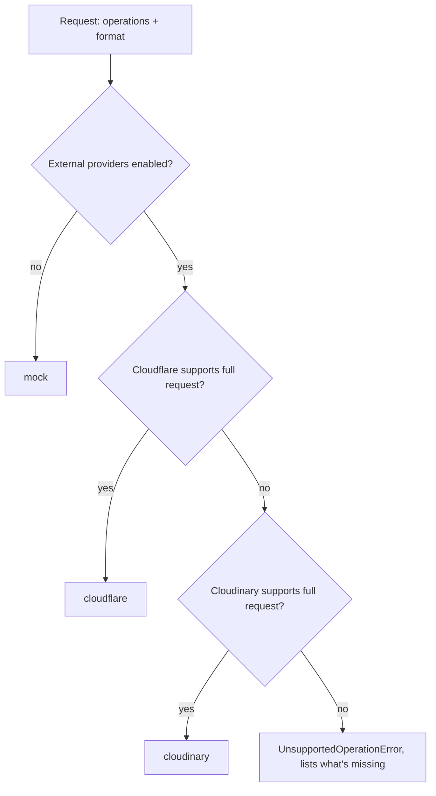
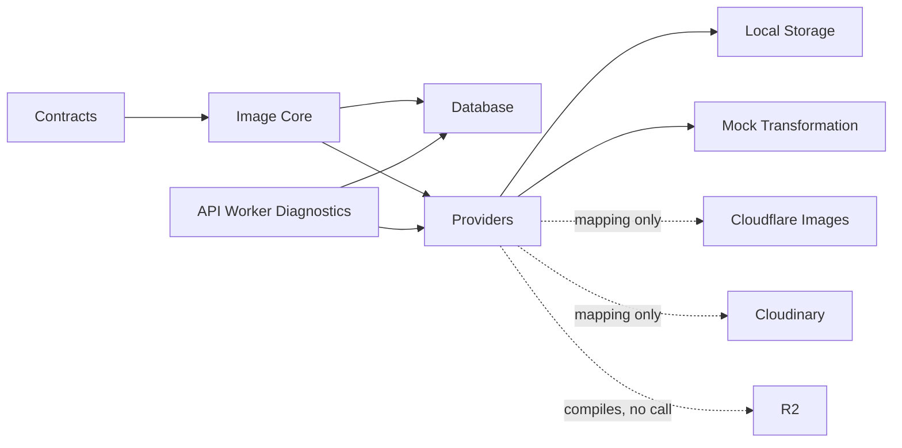

# Architecture

This document describes how Imageryx's apps and packages fit together:
what exists today (through Phase 2) and what each is designed to do once
later phases land. See [ROADMAP.md](ROADMAP.md) for the phase breakdown
and [context.md](context.md) for product/technology decisions and the
detailed rationale behind the choices summarized here.

## Applications

```
apps/
  dashboard/          Analog + Angular 21 — project/asset management UI
  api-worker/          Cloudflare Worker (Hono) — public API entry point
  delivery-worker/      Cloudflare Worker (Hono) — asset delivery edge
  processing-worker/    Cloudflare Worker — transformation job runner
```

### dashboard

**Responsibility:** the human-facing control plane — browsing assets,
managing projects/presets, inspecting API usage, and (this phase) showing
whether the rest of the system is healthy.

- **Phase 1 (current):** application shell, navigation, theme, and an
  Overview page that polls every Worker's `/health` endpoint live. The
  other six routes are static "upcoming" placeholders.
- **Later phases:** real asset library, project/preset CRUD, upload flow,
  API key management — all built on `@imageryx/sdk` and `@imageryx/angular`.

### api-worker

**Responsibility:** the single public entry point. Owns auth, request
validation, and orchestration — it never touches image bytes directly.

- **Phase 1:** `GET /health`, `GET /v1/info` only. Request ID middleware,
  structured logging, CORS (scoped to the local dashboard origin), and
  central error handling are in place so business routes have somewhere
  consistent to land.
- **Phase 2 (current):** adds a real D1 binding (`env.DB`, see
  `wrangler.jsonc`) and four read-only diagnostic routes —
  `GET /v1/diagnostics/domain`, `GET /v1/diagnostics/database`,
  `GET /v1/diagnostics/providers`, `GET /v1/diagnostics/seed` — that
  report real local domain/database/provider/seed state, so Phase 2 can be
  inspected end to end without a full upload API. No write routes exist
  yet; the only thing that writes to the local D1 database is
  `packages/database/scripts/seed.ts`.
- **Later phases:** upload routes (issuing storage writes via
  `@imageryx/providers`), transformation-request routes (enqueuing jobs
  for `processing-worker`), and project/preset/API-key CRUD backed by
  `@imageryx/database`.

### delivery-worker

**Responsibility:** the read path. Serves transformed assets to end users,
cache-first, independent of `api-worker`'s request/response cycle.

- **Phase 1 (current):** `GET /health` and `GET /preview-placeholder`, a
  small SVG generated in code — no stored assets, no cache, no R2.
- **Later phases:** fetches a transformed asset (from cache or by asking
  `processing-worker` to produce it), sets long-lived cache headers, and
  serves it. Never runs untrusted transformation logic itself.

### processing-worker

**Responsibility:** runs transformation jobs off the request path, so
`api-worker` and `delivery-worker` stay fast and don't block on CPU-heavy
image work.

- **Phase 1 (current):** `GET /health` plus a Cloudflare Queue consumer
  that only understands one job shape — a typed placeholder it
  acknowledges (or retries, if malformed). No image decoding happens.
- **Later phases:** consumes real transformation jobs, calls into
  `@imageryx/image-core` for the actual pixel work, and writes the result
  back to storage via `@imageryx/providers`.

## Domain package boundaries

Strict, one-directional dependency graph — enforced by convention (there
is no build-time lint rule for it yet, so review new imports against this
by hand):

```
contracts  ->  (nothing — Zod + shared primitives only)
image-core ->  contracts
database   ->  contracts, image-core
providers  ->  contracts, image-core
test-utils ->  contracts, image-core, database
```

- `@imageryx/contracts` never imports `image-core`, `database`, or
  `providers` — it's the innermost package, pure Zod schemas and inferred
  types, organized by domain (`projects/`, `folders/`, `assets/`,
  `presets/`, `variants/`, `processing/`, `providers/`) rather than one
  flat file.
- `@imageryx/image-core` never imports `database`, Hono, Angular,
  Cloudflare, or Cloudinary — every function in it (filename/path
  normalization, MIME validation, checksums, preset hashing, provider
  selection) is a pure, runtime-independent function of its inputs. This
  is what makes it unit-testable without a Worker, a browser, or a
  database.
- `@imageryx/database` and `@imageryx/providers` are siblings — neither
  depends on the other. A future persistence-aware provider (unlikely, but
  the reason for the rule) would go through a service in `database`, not
  the other way around.
- Within `database` and `providers`, **Node-only code lives behind a
  separate subpath export**, never the main barrel: `@imageryx/database/testing`
  (Miniflare-backed D1 test harness, uses `node:fs`) and
  `@imageryx/providers/node` (`LocalStorageProvider`, uses `node:fs`).
  `@imageryx/test-utils` mirrors this with its own `/node` subpath. This
  is a real constraint, not tidiness: importing the main `@imageryx/providers`
  barrel from a Cloudflare Worker must never transitively pull in
  `node:fs`, or the Worker fails to type-check (and would fail to run —
  workerd has no real filesystem).

## Database schema overview

D1 (SQLite), schema in `packages/database/migrations/0001_initial_schema.sql`,
10 tables: `projects`, `folders`, `assets`, `tags`, `asset_tags`, `presets`,
`variants`, `processing_jobs`, `api_keys`, `asset_activity`.

- **Deletion strategy:** deleting a project cascades to everything under
  it. Deleting a folder cascades to its subfolder tree but **never** to
  assets (`assets.folder_id` is `ON DELETE SET NULL` — assets become
  root-level, never disappear). See context.md for the full rationale.
- **Uniqueness via partial indexes**, not composite `UNIQUE` columns,
  wherever `NULL` needs to participate meaningfully: sibling folder slugs
  (root vs. nested), active (non-deleted) asset paths, and the
  asset+preset-hash pair on `variants` (`DuplicateVariantError` is raised
  when this constraint fails, not a raw SQL error).
- **JSON columns are never trusted blindly on read.** `presets.operations`,
  `processing_jobs.input`, and `processing_jobs.result` are stored as
  `TEXT` (JSON) and re-validated against the same Zod schema used to
  accept them on write, every time a repository maps a row back to a
  domain object.
- **API keys never store a complete key** — only a prefix (for lookup) and
  a secure hash of the secret.
- Repository classes (`ProjectRepository`, `FolderRepository`,
  `AssetRepository`, `TagRepository`, `PresetRepository`,
  `VariantRepository`, `ProcessingJobRepository`, `AssetActivityRepository`)
  wrap all of this in `packages/database/src/repositories/` — always
  parameterized queries, always explicit row-mapping functions, never
  raw SQL built from concatenated user input.
- Three services (`AssetPersistenceService`, `PresetPersistenceService`,
  `VariantPersistenceService`) handle cross-table writes. Two of them use
  real `db.batch()` atomicity (asset+activity, variant+processing-job);
  see context.md for exactly why and where that stops being possible with
  D1's actual transaction model.

## Provider interfaces

`@imageryx/providers` defines two interfaces
(`packages/providers/src/storage/storage-provider.ts` and
`.../transformations/transformation-provider.ts`) and implements them:

| Interface                | Implementations                                                                                                                                                                                                                     |
| ------------------------ | ----------------------------------------------------------------------------------------------------------------------------------------------------------------------------------------------------------------------------------- |
| `StorageProvider`        | `LocalStorageProvider` (real, filesystem, Node-only, `/node` subpath), `R2StorageProvider` (compiles against the real `R2Bucket` binding type, makes no request yet)                                                                |
| `TransformationProvider` | `MockTransformationProvider` (real, deterministic simulated results), `CloudflareImagesProvider` / `CloudinaryProvider` (real parameter-mapping functions; `transform()` always throws — no real network calls until a later phase) |

A `ProviderRegistry` (`packages/providers/src/registry/provider-registry.ts`)
selects an implementation from validated env config
(`parseProviderConfig`, Zod-validated, fails fast on an invalid or
incomplete combination — e.g. Cloudinary selected without credentials).
The Workers-safe registry throws `ProviderUnavailableError` for
`storageProvider: 'local'`; `@imageryx/providers/node`'s registry adds
that case back for Node-only tooling.

## Storage-key strategy: logical path vs. physical key

Two deliberately incompatible identifier spaces (`@imageryx/image-core`):

- **Logical paths** (`profile/andrii`) describe where an asset lives in a
  project's _folder tree_ — user-facing, renameable, strictly validated
  (traversal, repeated separators, and encoded tricks are all rejected
  outright, never silently normalized).
- **Physical storage keys** (`originals/{projectId}/{assetId}/original.{ext}`,
  `derived/{projectId}/{assetId}/{presetHash}.{ext}`) are opaque,
  provider-facing, and built only from our own generated identifiers —
  never from a logical path or a raw filename.

Keeping these separate is what lets a folder or asset be renamed without
moving a single byte in storage.

## Preset normalization and hashing

A preset's `operations` array is normalized (`@imageryx/image-core`'s
`normalizePreset`) before hashing: equivalent definitions (an omitted
optional field vs. its explicit default, `#fff` vs `#ffffff`) collapse to
the same canonical JSON, then SHA-256 (`hashPreset`) — deterministic, and
provider-specific mapping output never feeds into it. Operation _order_ is
preserved, not sorted — order is semantically significant for an image
pipeline. This hash is what `VariantRepository`'s uniqueness constraint
and `buildVariantObjectName`/`buildDerivedStorageKey` key off of, not the
preset's slug (a preset can be renamed without invalidating its
already-generated variants).

## Provider-selection flow

`selectTransformationProvider` (`@imageryx/image-core`) is a pure function
of the request and each candidate's declared capabilities:



An explicit `preferredProvider` short-circuits this and is validated the
same way (throws if unregistered, disabled, or unsupported). Nothing is
ever silently dropped or downgraded.

## Local-mode architecture

Local development uses **one real D1 database and one real local
filesystem directory**, shared by every tool that touches them:

- `apps/api-worker/wrangler.jsonc` declares the `DB` D1 binding
  (`database_name: imageryx-db`, `migrations_dir: ../../packages/database/migrations`)
  and `LOCAL_STORAGE_PATH`.
- `pnpm db:migrate:local` runs `wrangler d1 migrations apply` (from
  `apps/api-worker`), writing to `.wrangler/state/v3/d1`.
- `pnpm db:seed:local` (`packages/database/scripts/seed.ts`) reads that
  same `wrangler.jsonc`, constructs a `Miniflare` instance with the
  identical binding value and persist root wrangler itself uses, and
  writes through the real `ProjectRepository`/`FolderRepository`/etc. plus
  `LocalStorageProvider` — not a separate copy of the data.
- `pnpm setup:local` chains storage-prepare → migrate → seed → status.
  `pnpm db:reset:local` / `pnpm storage:reset:local` are separate,
  explicitly destructive scripts with hard-coded path safeguards — neither
  runs as part of `setup:local`.



## Planned data flows

These flows describe **future** behavior — all three are Phase 3 scope.
Every primitive they need (repositories, providers, domain validation)
exists as of Phase 2; what's missing is the routes that call them.

### Upload flow (Phase 3)

1. Dashboard (or an SDK consumer) sends the file to `api-worker`.
2. `api-worker` validates the request (`image-core`'s `validateImageAsset`),
   writes the original via the configured `StorageProvider`, and records
   metadata through `AssetPersistenceService.createAssetWithActivity`.
3. `api-worker` returns an asset ID and a delivery URL template.

### Processing flow (Phase 3)

1. A transformation is requested (either at upload time or on first
   delivery request for a given variant).
2. `api-worker` (or `delivery-worker`, for on-demand variants) enqueues a
   job for `processing-worker`.
3. `processing-worker` runs the pipeline in `@imageryx/image-core` and
   writes the result via the configured `StorageProvider`.

### Delivery flow (Phase 3)

1. A client requests an asset variant from `delivery-worker`.
2. `delivery-worker` checks cache; on a hit, it serves directly.
3. On a miss, it fetches the source via `StorageProvider`, requests (or
   waits for) the transformation, caches the result, and serves it.

## Shared packages

| Package                              | Role as of Phase 2                                                                                                                                                                                                                                                           |
| ------------------------------------ | ---------------------------------------------------------------------------------------------------------------------------------------------------------------------------------------------------------------------------------------------------------------------------- |
| `contracts`                          | Full domain Zod schemas + inferred types (projects, folders, assets, presets, variants, processing jobs, providers), organized by domain, plus the Phase 1 `HealthCheckResponse` shape                                                                                       |
| `image-core`                         | Provider-independent domain logic: filename/path normalization, MIME/signature validation, checksums, preset normalization + hashing, transformation validation, provider selection, job/variant state machines                                                              |
| `database`                           | D1 schema + migrations, 8 repository classes, 3 cross-table persistence services; `/testing` subpath exposes a real Miniflare-backed D1 test harness                                                                                                                         |
| `providers`                          | `StorageProvider`/`TransformationProvider` interfaces and implementations (local filesystem, R2 binding-ready, mock transform, Cloudflare/Cloudinary parameter mapping) plus a validated-config provider registry; `/node` subpath adds the Node-only local storage provider |
| `test-utils`                         | `isValidHealthCheckResponse` (every health test) plus domain fixture builders (`createProjectFixture`, etc.) and, via `/node`, a D1 test database + temporary storage directory helper                                                                                       |
| `typescript-config`, `eslint-config` | Shared strict TS/lint configuration                                                                                                                                                                                                                                          |
| `sdk`, `angular`                     | Metadata-only placeholders — see each package's README for what's deferred                                                                                                                                                                                                   |
