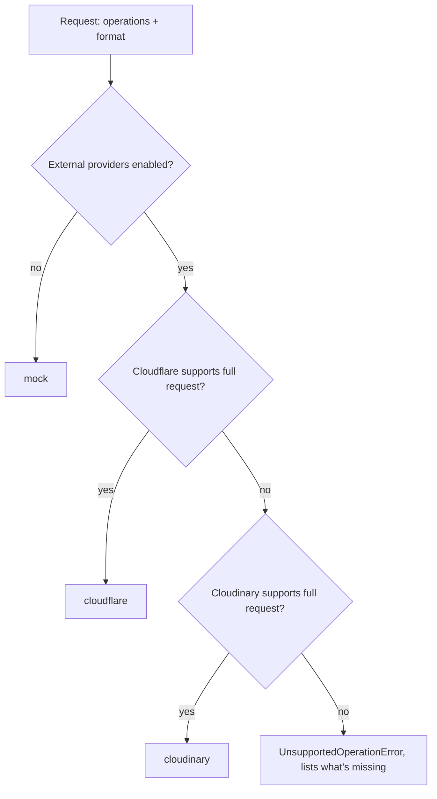
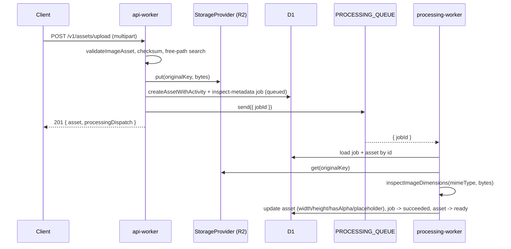
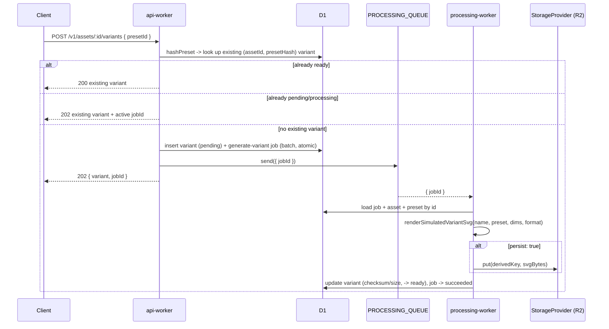
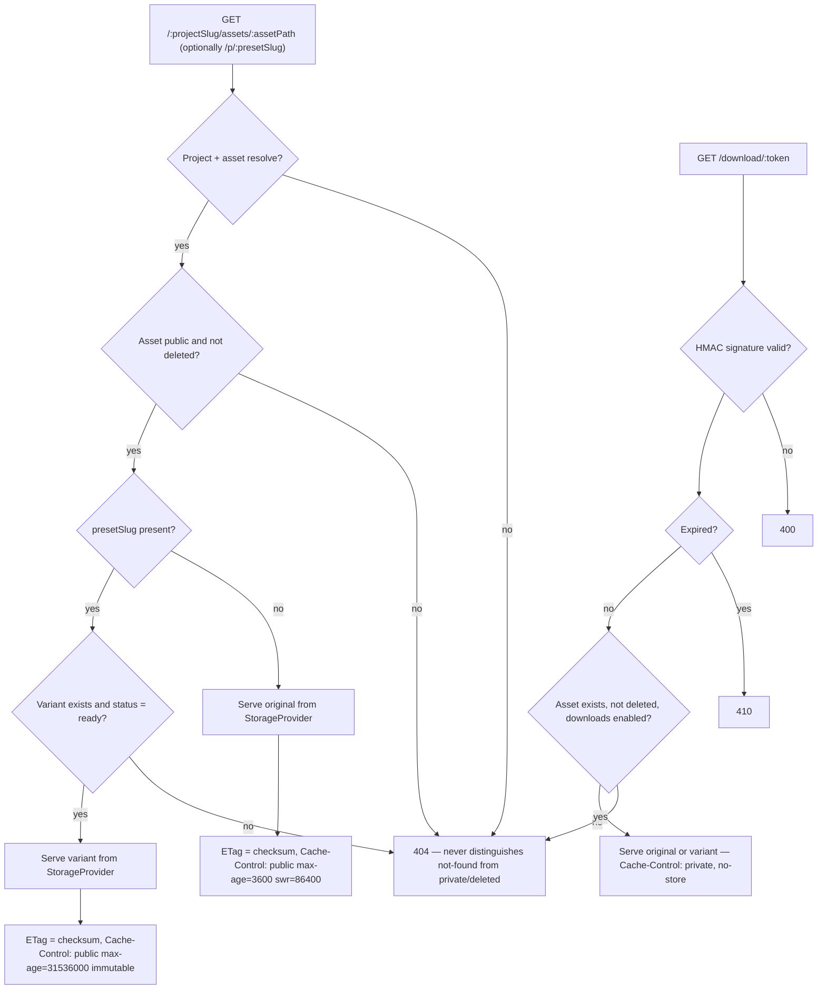

# Architecture

This document describes how Imageryx's apps and packages fit together:
what exists today (through Phase 3) and what each is designed to do once
later phases land. See [ROADMAP.md](ROADMAP.md) for the phase breakdown
and [context.md](context.md) for product/technology decisions and the
detailed rationale behind the choices summarized here — in particular its
"Phase 3 decisions and limitations" section, which this document only
summarizes.

## Applications

```
apps/
  dashboard/          Analog + Angular 21 — project/asset management UI
  api-worker/          Cloudflare Worker (Hono) — public API entry point
  delivery-worker/      Cloudflare Worker (Hono) — asset delivery edge
  processing-worker/    Cloudflare Worker — transformation job runner
```

### dashboard

**Responsibility:** the human-facing control plane — browsing assets,
managing projects/presets, inspecting API usage, and showing whether the
rest of the system is healthy.

- **Phase 1:** application shell, navigation, theme, and an Overview page
  that polls every Worker's `/health` endpoint live. The other six routes
  are static "upcoming" placeholders.
- **Phase 3 (current):** adds one dev-only route, `/dev-flow`, that drives
  the real backend end to end (project/folder pick, upload, processing
  status, preset variant generation, delivery URLs, a live `<imgyx-image>`
  render) through `@imageryx/sdk`, itself routed through a same-origin
  server-side proxy (`server/routes/api/[...path].ts`, an Analog/Nitro h3
  route) that injects the API key server-side — the browser never holds
  it. Every other route is still a Phase 4 placeholder.
- **Later phases:** real asset library, project/preset CRUD, upload flow,
  API key management — all built on the same `@imageryx/sdk` and
  `@imageryx/angular` this phase already ships and tests.

### api-worker

**Responsibility:** the single public entry point. Owns auth, request
validation, and orchestration — it never touches image bytes directly and
never runs expensive processing inline in a route handler.

- **Phase 1:** `GET /health`, `GET /v1/info` only.
- **Phase 2:** adds a D1 binding and four read-only diagnostic routes.
- **Phase 3 (current):** every `/v1/*` route requires `Authorization:
  Bearer <IMAGERYX_API_KEY>` (constant-time comparison). Full CRUD for
  projects, folders, tags, presets (+ preview), assets (+ multipart
  upload, move, tagging, activity, variant listing, delivery info, signed
  download-url issuance, soft delete/restore), variant generation
  (idempotent), processing-job management (list/retry/cancel), and an
  aggregate `/v1/stats` route. Upload writes go through the configured
  `StorageProvider` (R2 locally, via Miniflare); a job is persisted and
  dispatched to `processing-worker` — via a real Cloudflare Queue message
  by default, or inline under `waitUntil` in `PROCESSING_MODE=inline-local`
  — never processed synchronously in the request.
- **Later phases:** project/preset-scoped activity as real rows (currently
  structured logs only — see context.md), richer job-listing pagination.

### delivery-worker

**Responsibility:** the read path. Serves original and transformed assets
to end users, cache-first, independent of `api-worker`'s request/response
cycle. Never an open image proxy — every path resolves to a specific
asset/variant this system produced.

- **Phase 1:** `GET /health` and a placeholder SVG route.
- **Phase 3 (current):** `GET /:projectSlug/assets/:assetPath[/p/:presetSlug]`
  resolves a public original or a `ready` preset variant, with correct
  ETag/Content-Length/Content-Type/Cache-Control and `nosniff`; private or
  soft-deleted assets always 404 (never a distinguishing status). A
  separate `GET /download/:token` route validates an HMAC-signed,
  time-limited token (issued by `api-worker`) for private or
  not-yet-public originals/variants — see "Signed downloads" in
  context.md. The old placeholder route is gone.
- **Later phases:** on-demand variant generation for a preset that hasn't
  been requested yet (today, a variant must already be `ready`; the
  delivery route never triggers processing itself).

### processing-worker

**Responsibility:** runs transformation jobs off the request path, so
`api-worker` and `delivery-worker` stay fast and don't block on CPU-heavy
image work. Consumes typed `{ jobId }` messages only — full payloads and
secrets are never put on the Queue; the handler re-reads everything it
needs from D1/storage by ID.

- **Phase 1:** `GET /health` plus a Cloudflare Queue consumer
  acknowledging one placeholder job shape.
- **Phase 3 (current):** two real job handlers. `inspect-metadata` parses
  real dimension/alpha data from image headers (PNG/JPEG/GIF/WebP/SVG; AVIF
  reports `null` with a warning, never a fabricated value) and generates a
  deterministic placeholder. `generate-variant` renders a real, visibly
  "Simulated transformation" SVG (via the mock `TransformationProvider`'s
  deterministic sizing plus `@imageryx/image-core`'s renderer) and, when
  `persist: true`, writes it through `StorageProvider` — never fakes a
  success response for the Cloudflare/Cloudinary providers, which still
  always throw. Failed jobs are classified retryable/non-retryable and
  respect `PROCESSING_MAX_ATTEMPTS`.
- **Later phases:** a real decode/resize/crop/encode pipeline (or a real
  Cloudflare Images/Cloudinary network call) replacing the mock provider's
  simulated output.

## Domain package boundaries

Strict, one-directional dependency graph — enforced by convention (there
is no build-time lint rule for it yet, so review new imports against this
by hand):

```
contracts  ->  (nothing — Zod + shared primitives only)
image-core ->  contracts
database   ->  contracts, image-core
providers  ->  contracts, image-core
test-utils ->  contracts, image-core, database, providers
sdk        ->  contracts, image-core
angular    ->  image-core   (deliberately not sdk or contracts — see below)
```

- `@imageryx/contracts` never imports `image-core`, `database`, or
  `providers` — it's the innermost package, pure Zod schemas and inferred
  types, organized by domain (`projects/`, `folders/`, `assets/`,
  `presets/`, `variants/`, `processing/`, `providers/`) rather than one
  flat file.
- `@imageryx/image-core` never imports `database`, Hono, Angular,
  Cloudflare, or Cloudinary — every function in it (filename/path
  normalization, MIME validation, checksums, preset hashing, provider
  selection) is a pure, runtime-independent function of its inputs. This
  is what makes it unit-testable without a Worker, a browser, or a
  database.
- `@imageryx/database` and `@imageryx/providers` are siblings — neither
  depends on the other. A future persistence-aware provider (unlikely, but
  the reason for the rule) would go through a service in `database`, not
  the other way around.
- Within `database` and `providers`, **Node-only code lives behind a
  separate subpath export**, never the main barrel: `@imageryx/database/testing`
  (Miniflare-backed D1 test harness, uses `node:fs`) and
  `@imageryx/providers/node` (`LocalStorageProvider`, uses `node:fs`).
  `@imageryx/test-utils` mirrors this with its own `/node` subpath. This
  is a real constraint, not tidiness: importing the main `@imageryx/providers`
  barrel from a Cloudflare Worker must never transitively pull in
  `node:fs`, or the Worker fails to type-check (and would fail to run —
  workerd has no real filesystem).
- `@imageryx/sdk` is a thin, framework-independent Fetch client — it
  depends on `contracts` (input/output shapes) and `image-core` (the
  shared delivery-URL builder, so the SDK and the Workers can never
  disagree on a delivery path), never on `database` or `providers`.
- `@imageryx/angular` deliberately depends on `image-core` only, **not**
  `@imageryx/sdk` — `<imgyx-image>` only ever needs to build a delivery
  URL string from inputs, never to call an authenticated API or hold a
  key, so it stays independent of the SDK's HTTP/auth surface entirely.

## Database schema overview

D1 (SQLite), schema in `packages/database/migrations/0001_initial_schema.sql`,
10 tables: `projects`, `folders`, `assets`, `tags`, `asset_tags`, `presets`,
`variants`, `processing_jobs`, `api_keys`, `asset_activity`.

- **Deletion strategy:** deleting a project cascades to everything under
  it. Deleting a folder cascades to its subfolder tree but **never** to
  assets (`assets.folder_id` is `ON DELETE SET NULL` — assets become
  root-level, never disappear). See context.md for the full rationale.
- **Uniqueness via partial indexes**, not composite `UNIQUE` columns,
  wherever `NULL` needs to participate meaningfully: sibling folder slugs
  (root vs. nested), active (non-deleted) asset paths, and the
  asset+preset-hash pair on `variants` (`DuplicateVariantError` is raised
  when this constraint fails, not a raw SQL error).
- **JSON columns are never trusted blindly on read.** `presets.operations`,
  `processing_jobs.input`, and `processing_jobs.result` are stored as
  `TEXT` (JSON) and re-validated against the same Zod schema used to
  accept them on write, every time a repository maps a row back to a
  domain object.
- **API keys never store a complete key** — only a prefix (for lookup) and
  a secure hash of the secret.
- Repository classes (`ProjectRepository`, `FolderRepository`,
  `AssetRepository`, `TagRepository`, `PresetRepository`,
  `VariantRepository`, `ProcessingJobRepository`, `AssetActivityRepository`)
  wrap all of this in `packages/database/src/repositories/` — always
  parameterized queries, always explicit row-mapping functions, never
  raw SQL built from concatenated user input.
- Three services (`AssetPersistenceService`, `PresetPersistenceService`,
  `VariantPersistenceService`) handle cross-table writes. Two of them use
  real `db.batch()` atomicity (asset+activity, variant+processing-job);
  see context.md for exactly why and where that stops being possible with
  D1's actual transaction model.

## Provider interfaces

`@imageryx/providers` defines two interfaces
(`packages/providers/src/storage/storage-provider.ts` and
`.../transformations/transformation-provider.ts`) and implements them:

| Interface                | Implementations                                                                                                                                                                                                                                                                    |
| ------------------------ | ------------------------------------------------------------------------------------------------------------------------------------------------------------------------------------------------------------------------------------------------------------------------------------ |
| `StorageProvider`        | `R2StorageProvider` (real — all three Workers use it against a real, if locally Miniflare-simulated, `R2Bucket` binding as of Phase 3), `LocalStorageProvider` (real, filesystem, Node-only, `/node` subpath — Node tooling/tests only, unreachable from any Worker)                |
| `TransformationProvider` | `MockTransformationProvider` (real — persists real, visibly-labeled simulated image bytes when `persist: true`), `CloudflareImagesProvider` / `CloudinaryProvider` (real parameter-mapping functions; `transform()` always throws — reachable but inert without real credentials) |

A `ProviderRegistry` (`packages/providers/src/registry/provider-registry.ts`)
selects an implementation from validated env config
(`parseProviderConfig`, Zod-validated, fails fast on an invalid or
incomplete combination — e.g. Cloudinary selected without credentials).
The Workers-safe registry throws `ProviderUnavailableError` for
`storageProvider: 'local'`; `@imageryx/providers/node`'s registry adds
that case back for Node-only tooling.

## Storage-key strategy: logical path vs. physical key

Two deliberately incompatible identifier spaces (`@imageryx/image-core`):

- **Logical paths** (`profile/andrii`) describe where an asset lives in a
  project's _folder tree_ — user-facing, renameable, strictly validated
  (traversal, repeated separators, and encoded tricks are all rejected
  outright, never silently normalized).
- **Physical storage keys** (`originals/{projectId}/{assetId}/original.{ext}`,
  `derived/{projectId}/{assetId}/{presetHash}.{ext}`) are opaque,
  provider-facing, and built only from our own generated identifiers —
  never from a logical path or a raw filename.

Keeping these separate is what lets a folder or asset be renamed without
moving a single byte in storage.

## Preset normalization and hashing

A preset's `operations` array is normalized (`@imageryx/image-core`'s
`normalizePreset`) before hashing: equivalent definitions (an omitted
optional field vs. its explicit default, `#fff` vs `#ffffff`) collapse to
the same canonical JSON, then SHA-256 (`hashPreset`) — deterministic, and
provider-specific mapping output never feeds into it. Operation _order_ is
preserved, not sorted — order is semantically significant for an image
pipeline. This hash is what `VariantRepository`'s uniqueness constraint
and `buildVariantObjectName`/`buildDerivedStorageKey` key off of, not the
preset's slug (a preset can be renamed without invalidating its
already-generated variants).

## Provider-selection flow

`selectTransformationProvider` (`@imageryx/image-core`) is a pure function
of the request and each candidate's declared capabilities:



An explicit `preferredProvider` short-circuits this and is validated the
same way (throws if unregistered, disabled, or unsupported). Nothing is
ever silently dropped or downgraded.

## Local-mode architecture

Local development uses **one real D1 database and one real, locally
Miniflare-simulated R2 bucket**, shared by every process that touches
them — three separate `wrangler dev` processes (one per Worker), the seed
script, and `pnpm processing:run-local` all point at the same directory:

- Every Worker's `wrangler.jsonc` declares the same `DB` D1 binding
  (`database_name: imageryx-db`, `migrations_dir: ../../packages/database/migrations`)
  and `ASSET_STORAGE` R2 binding (`bucket_name: imageryx-storage`).
- Every `dev`/`db:migrate:local`/`db:status:local` script across all three
  apps, plus the seed script and `processing:run-local`, pass
  `--persist-to ../../.wrangler-state` (or construct a `Miniflare`
  instance with the equivalent `defaultPersistRoot`), so
  `.wrangler-state/v3/{d1,r2}` (git-ignored) is genuinely the single
  source of local state — an asset uploaded via `api-worker` is
  immediately visible to `processing-worker`'s Queue consumer and
  `delivery-worker`'s reads, confirmed working via live manual testing of
  the full pipeline across three concurrently-running processes.
- `pnpm db:seed:local` (`packages/database/scripts/seed.ts`) reads
  `api-worker`'s `wrangler.jsonc`, constructs a `Miniflare` instance with
  the identical bindings and persist root `wrangler dev` uses, and writes
  through the real repositories plus a real `R2StorageProvider` — not a
  separate copy of the data.
- `pnpm setup:local` chains storage-prepare → migrate → seed → status.
  `pnpm db:reset:local` / `pnpm storage:reset:local` are separate,
  explicitly destructive scripts with hard-coded path safeguards — neither
  runs as part of `setup:local`.

```mermaid
flowchart LR
  Contracts --> Core[Image Core]
  Core --> Database
  Core --> Providers
  API[api-worker] --> Database
  API --> Providers
  API -- Queue message: jobId only --> Processing[processing-worker]
  Processing --> Database
  Processing --> Providers
  Delivery[delivery-worker] --> Database
  Delivery --> Providers
  Providers --> R2[(R2 — Miniflare-simulated locally)]
  Providers --> MockTransformation[Mock Transformation]
  Providers -. mapping only, transform&#40;&#41; throws .-> CloudflareImages[Cloudflare Images]
  Providers -. mapping only, transform&#40;&#41; throws .-> Cloudinary
```



## Upload and processing flow



## Variant generation flow



## Delivery flow



All three flows are implemented as of Phase 3 and verified against real,
concurrently-running local Workers — not just isolated unit tests. See
context.md's "Phase 3 decisions and limitations" for the full detail
behind each step (upload consistency guarantees, idempotency, the
delivery-route `/p/` marker ambiguity, caching policy, etc.).

## Shared packages

| Package                              | Role as of Phase 3                                                                                                                                                                                                                                                                        |
| ------------------------------------- | -------------------------------------------------------------------------------------------------------------------------------------------------------------------------------------------------------------------------------------------------------------------------------------- |
| `contracts`                          | Full domain Zod schemas + inferred types (projects, folders, assets, presets, variants, processing jobs, stats, providers), organized by domain, plus the Phase 1 `HealthCheckResponse` shape                                                                                            |
| `image-core`                         | Provider-independent domain logic: filename/path normalization, MIME/signature validation, checksums, preset normalization + hashing, transformation validation, provider selection, job/variant state machines, **plus (Phase 3)** real per-format dimension inspection, HMAC signed tokens, constant-time comparison, the shared delivery-path/URL builder, simulated-variant SVG rendering, and placeholder generation |
| `database`                           | D1 schema + migrations, repository classes (with Phase 3 additions: bulk counts, folder subtree moves, tag CRUD, activity feeds), 3 cross-table persistence services; `/testing` subpath exposes a real Miniflare-backed D1 test harness                                                |
| `providers`                          | `StorageProvider`/`TransformationProvider` interfaces and implementations (local filesystem — Node-only, R2 — real, used by every Worker, mock transform — real, Cloudflare/Cloudinary parameter mapping) plus a validated-config provider registry; `/node` subpath adds the Node-only local storage provider |
| `sdk`                                 | Real, tested, framework-independent Fetch client (`createImageryxClient`) — typed resource namespaces, typed errors, FormData upload, delivery-URL/snippet helpers                                                                                                                       |
| `angular`                             | Real, tested standalone `<imgyx-image>` component — signal inputs/outputs, responsive preset support, no SDK or API-key dependency                                                                                                                                                       |
| `test-utils`                         | `isValidHealthCheckResponse` plus domain fixture builders and, via `/node`, a D1 test database + temporary storage directory helper, plus (Phase 3) real decodable-image fixtures (PNG/JPEG/GIF/WebP/SVG/AVIF) for metadata-inspection tests                                            |
| `typescript-config`, `eslint-config` | Shared strict TS/lint configuration                                                                                                                                                                                                                                                        |
